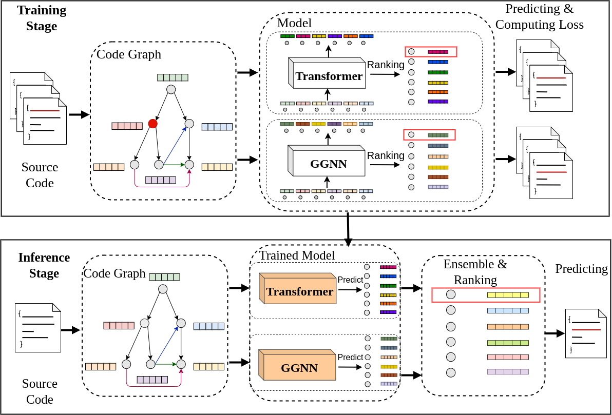

<p align="center">
  
  
</p>

# VELVET: a noVel Ensemble Learning approach to automatically locate VulnErable sTatements ([SANER 2022](https://saner2022.uom.gr/restrack))

This [paper](https://arxiv.org/abs/2112.10893) presents VELVET, a novel ensemble learning approach to locate vulnerable statements. Our model combines graph-based and sequence-based neural networks to successfully capture the local and global context of a program graph and effectively understand code semantics and vulnerable patterns. This work is done by researchers from Columbia University and IBM Research.

## Data

This paper considers two datasets as the main resources for the evaluation:
* [Juliet Test Suite for C/C++](https://samate.nist.gov/SRD/testsuite.php)
* [IBM D2A Dataset](https://developer.ibm.com/exchanges/data/all/d2a/). Our processed function-level dataset can be found [here](https://drive.google.com/drive/folders/1Q-yApGmz-HyNdrgN8jxy2ugG-cmmGu7B?usp=sharing).

## Approach
<p align="center">
  
</p>

Graph-based neural networks are effective at understanding the semantic order of programs, since they directly learn control flows and data dependencies with the pre-defined edges. However, training involves a message passing algorithm where nodes only communicate with their neighbors. The ability to learn long-range dependencies is limited by the number of message passing iterations, which are typically set to a small number (e.g., less than eight) due to computational cost. Such a limitation will result in an inherently local model. In contrast, Transformer allows global, program-wise information aggregation, and without pre-defined edges, the self-attention mechanism of Transformer is expected to encode considerable code semantics – which can be complementary to those defined explicitly by the code graph. Therefore, to learn the diversity of vulnerable patterns, we separately train these two distinct models and use their predictions in an ensemble learning setting at inference time.

Our implementation for the model can be found [here](src/).

## Citation
```
@misc{ding2021velvet,
      title={VELVET: a noVel Ensemble Learning approach to automatically locate VulnErable sTatements}, 
      author={Yangruibo Ding and Sahil Suneja and Yunhui Zheng and Jim Laredo and Alessandro Morari and Gail Kaiser and Baishakhi Ray},
      year={2021},
      eprint={2112.10893},
      archivePrefix={arXiv},
      primaryClass={cs.SE}
}
```
